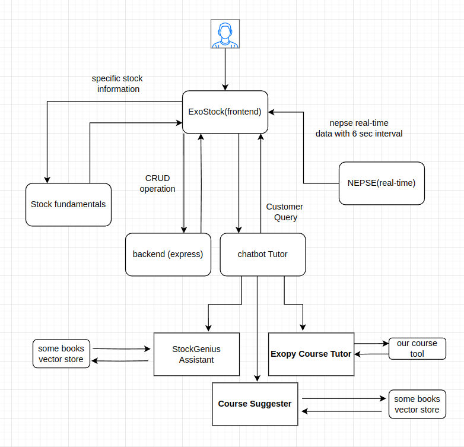

# NepStockLab

ExStock is a virtual stock trading platform that provides a risk-free environment for users to learn and practice stock trading using real-time NEPSE (Nepal Stock Exchange) data.



## Problem Statement
ExStock addresses several critical challenges in the Nepalese stock market ecosystem:

- **High Barrier to Entry for New Investors**: The Nepal Stock Exchange (NEPSE) can be intimidating for beginners due to complex terminology, trading mechanisms, and the inherent risk of financial loss. This prevents many potential investors from participating in the market.
- **Limited Access to Educational Resources**: There is a scarcity of accessible, interactive, and personalized learning resources for stock trading specifically tailored to the NEPSE context, leaving many aspiring investors without proper guidance.
- **Risk Aversion Among New Traders**: The fear of losing real money prevents many individuals from gaining practical trading experience, creating a catch-22 situation where experience is needed but difficult to obtain without financial risk.
- **Lack of Pattern Recognition Skills**: Many new investors struggle to identify trends and patterns in stock price movements, leading to impulsive or poorly timed investment decisions.
- **Absence of Personalized Guidance**: Traditional stock trading education often lacks the personalized approach needed to address individual learning styles, risk tolerances, and knowledge gaps.

## Features

- **Virtual Trading Simulation** - Buy and sell stocks using virtual currency with real-time NEPSE market data
- **Personalized AI Tutor** - Get guidance and learn stock trading concepts from an intelligent assistant
- **Pattern Recognition Learning** - Analyze historical stock data to identify trends and patterns
- **Risk-Free Environment** - Practice trading strategies without risking real money

## Technical Stack

### Frontend
- **React** - Modern UI framework for building responsive interfaces

### Backend
- **Express.js** - Robust Node.js framework for API development
- **WebSocket** - Real-time NEPSE data scraping at 6-second intervals
- **API Integration** - Stock fundamentals data scraping and integration

### AI Components
- **LangGraph** - For building the AI tutor conversation flows
- **Milvus Vector Store** - Efficient storage and retrieval of financial knowledge
- **Persistent Memory** - Context-aware chatbot with memory of user interactions
- **Multi-Agent Framework** - Specialized AI agents for different trading aspects

## System Architecture

Our system utilizes a modular architecture with real-time data processing:

1. Data Collection Layer - Continuously scrapes NEPSE data and fundamental stock information
2. Processing Layer - Transforms and analyzes stock data
3. AI Layer - Powers the personalized tutoring system
4. Application Layer - Combines backend services with frontend UI
5. User Interface - Intuitive interface for trading and learning

## Team Members

- **Nikesh** - Backend Engineer
- **Mandip** - Frontend Engineer
- **Richma** - Frontend Engineer
- **Jyotsan** - AI Engineer

## Getting Started

### Prerequisites
- Node.js (v14+)
- npm or yarn
- MongoDB

### Installation
```bash
# Clone the repository
git clone https://github.com/jyotsanh/ExStock
cd ExStock

# Install dependencies for backend
cd backend
npm install

# Install dependencies for frontend
cd ../frontend
npm install
```

### Running the Application
```bash
# Start the backend server port 3000
cd backend
npm run start

# In a separate terminal, start the frontend port 5173
cd frontend
npm run start

# to download all price history data of all the stock of 321 nepali data 
cd scrapperBot
python selenium_scrapper.py

# to run a second microservice which gives you:
# -> realtime nepse data (websocket)
# -> any specific stock fundamentals data
# -> price history data of 100 days 
cd nepseAPI
uvicorn scrapper:app --reload --port 8015

# for chatbot api
cd chatapi
uvicorn server:app --reload --port 8020
```

## Development

### Backend Development
```bash
cd backend
npm run dev
```

### Frontend Development
```bash
cd frontend
npm run dev
```

## Running the Scrapper:
```bash
cd nepseAPI
pip install -r requirements.txt
uvicorn scrapper:app --reload
```

## License

This project is licensed under the MIT License - see the LICENSE file for details.

## Acknowledgments

- NEPSE for providing the market data infrastructure
- Open-source AI and financial analytics libraries that make this project possible